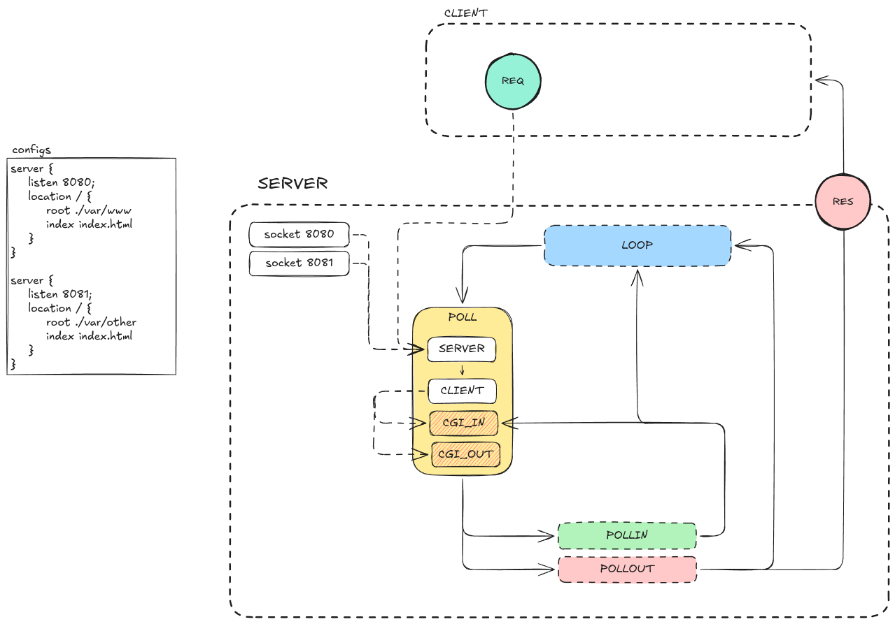
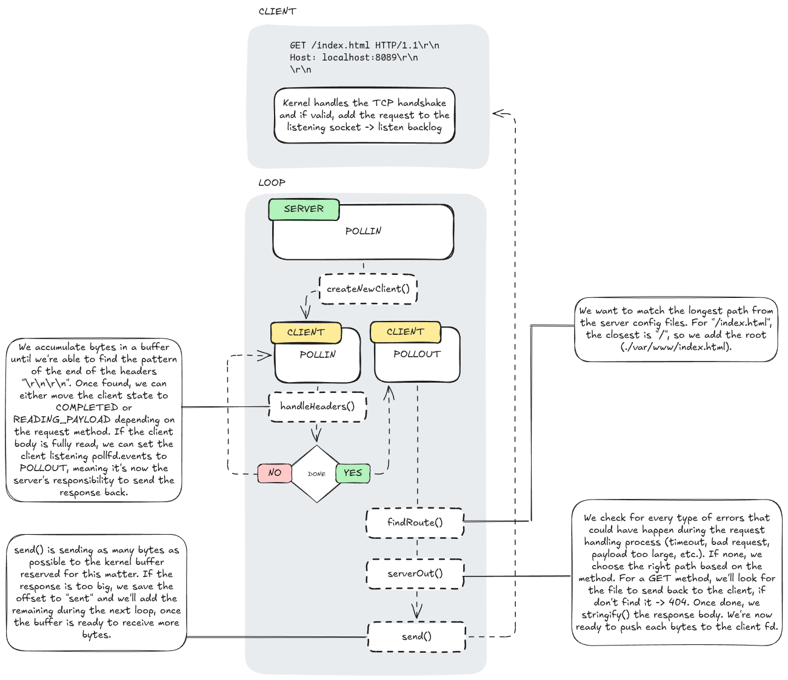

*This project has been created as part of the 42 curriculum by vibarre, vivaz-ca.*

# Webserv

## Description

Webserv is a fully custom HTTP/1.1 server written from scratch in C++98, built to run without
any external or Boost libraries. It parses a configuration file (inspired by NGINX's `server`
block syntax), binds to one or more `interface:port` pairs, and serves static files, handles
file uploads, deletes resources, and executes CGI scripts (e.g. Python) based on file extension.

All client and CGI I/O (accept, read, write) is driven through a single non-blocking `poll()`
loop — the server never issues a `read`/`write`/`recv`/`send` without first checking that the
file descriptor is ready, and it never crashes or hangs on a malformed or slow client.

Key features:
- Configuration file defining multiple listening ports, routes, error pages and body size limits
- `GET`, `POST`, and `DELETE` methods
- Static file serving, directory listing (autoindex) on/off per route, and default index files
- File uploads with a configurable storage directory
- CGI execution (e.g. Python) based on file extension, with request data passed via environment
  variables and stdin/stdout pipes
- Per-route configuration: allowed methods, root/alias directory, redirection, default file,
  autoindex, upload directory, CGI mapping
- Custom default error pages, used when none are configured

Here is how the server works:


## The full journey `GET /index.html HTTP/1.1` 
0. On the browser side, before your code runs:
- localhost → 127.0.0.1 (via /etc/hosts);
- the TCP handshake is completed by the kernel, which puts the connection in the listening socket's
queue (listen backlog).

1. New connection: case SERVER
- poll() reports POLLIN on the listening socket for 8089.
- createNewClient() → accept() returns a new file descriptor for this client, which is set to
O_NONBLOCK and FD_CLOEXEC, wrapped in a Connection of type CLIENT (with its own Request/Response),
and put in newConns.
- At the end of the loop, it moves into serverConnections, with events = POLLIN.

2. Reading the request: case CLIENT, POLLIN
- On a next poll(), the client's socket reports POLLIN. recv() → the bytes are appended to buffer →
lastActive is updated.
- As long as \r\n\r\n isn't found, you wait for the next recv (with the 16 KB → 431 limit).
- Once found: handleHeaders() → parseHeaders() (method, path, version, headers) → checkHeaders() (..
in the path, version, Host), otherwise 400.

3. Route and validation
- findRoute("/index.html", router): longest prefix, so location /.
- validateRequest(): is the method known (otherwise 501)? Is GET allowed (otherwise 405)? A redirect
(301)? Is Content-Length too big (413)?
- No Content-Length and not chunked → no body → finishRequest(): state = COMPLETED, events = POLLOUT,
and isCgi()? No, .html isn't a CGI extension.

4. Building the response: case CLIENT, POLLOUT → sendDataToClient()
- OUT():
- getPath() = root + path = ./var/www + /index.html = ./var/www/index.html (the full URI, including
    the /);
- stat() finds it exists and isn't a directory → access(R_OK) → readFileContent() → statusCode = 
    200.
- SEND(): Content-Type: text/html via getMimeType(".html"), Content-Length: 1649, Connection: close.
- stringify(): status line + headers + \r\n + body, all in RES->body.

5. Sending
- send() with RES->sent, possibly over several POLLOUT rounds if it's a partial write.
- When sent == body.size() → sendDataToClient() returns 0 → closeConnection(): close(fd), delete,
erase from the vector, curIdx--.

6. After
- The browser displays the HTML, then sends new requests for the CSS and images. Because of Connection: close, each one goes over a new TCP connection, so back to step 1.
- The listening socket, meanwhile, never stopped being watched.




## Instructions

### Compilation

```sh
make        # builds the ./webserv executable
make clean  # removes object files
make fclean # removes object files and the executable
make re     # fclean + all
```

Requires a C++98-compatible compiler (`c++`). No external dependencies.

### Running

```sh
./webserv [configuration file]
```

Example, using one of the provided templates:

```sh
./webserv server.conf
```

Then point a browser or `curl`/`telnet` at the configured host/port(s), e.g.:

```sh
curl http://localhost:8089/
```

### Configuration file

The configuration file uses an NGINX-inspired `server { ... }` block syntax. Each `server`
block defines one or more `listen` ports and a set of `location` blocks. Example:

```
server {
	listen 8089;
	client_max_body_size 1024;

	location / {
		root ./var/www;
		index /index.html;
		allowed_methods GET POST;
	}

	location /upload {
		root ./var/www;
		upload_store /uploads;
	}

	location /delete {
		root ./var/www/uploads;
		allowed_methods DELETE;
	}
}
```

Sample configuration files and their matching static/CGI/upload content used to exercise every
feature during evaluation are provided under `templates/conf/` and `var/`.

## Resources

- [RFC 7230 — HTTP/1.1: Message Syntax and Routing](https://www.rfc-editor.org/rfc/rfc7230)
- [RFC 7231 — HTTP/1.1: Semantics and Content](https://www.rfc-editor.org/rfc/rfc7231)
- [NGINX documentation — `server` and `location` block reference](https://nginx.org/en/docs/)
- [Common Gateway Interface (CGI) — RFC 3875](https://www.rfc-editor.org/rfc/rfc3875)
- `poll(2)` / `select(2)` man pages

### AI usage

We used AI (Claude) as an assistant, not as the author of the project. The architecture and the core of every feature (the `poll()` loop, request parsing, CGI handling, the configuration parser) were designed and written by us. AI came in afterwards, mainly for:
- **Edge-case testing.** We built the structure of the config tests (`tests/configsFiles/`, `tests/tester.py`) and asked AI: *"based on my current structure, add hardcore tests"*. It generated about 120 malformed or unusual configuration files, after the 6th we already created.
- **Review against the subject.** AI reviewed the codebase and helped us reproduce bugs with `curl`, `nc`, and `siege`.
- **Fixes.** For each bug, we first worked out the cause together. For some fixes AI proposed the code, which we reviewed, integrated ourselves and tested again.
- **Documentation and debugging.** Structuring and wording this README, and helping during debugging sessions when we were stuck. It also helped us debug a potential `atoi` undefined behavior, chunked bodies containing `\r\n`, HTTP/1.0 requests without a `Host` header.
